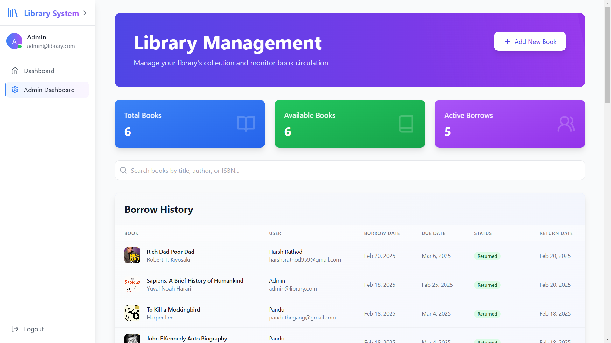
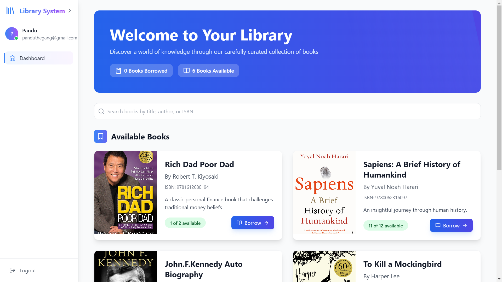

# 📚 Library Management System

A modern, full-featured library management system built with React, Firebase, and Tailwind CSS.

## ✨ Features

🔐 **Authentication & Authorization**
- Secure email/password authentication
- Role-based access control (Admin/User)
- Protected routes and API endpoints

📖 **Book Management**
- Comprehensive book catalog
- Real-time availability tracking
- ISBN-based book information
- Book quantity management

👥 **User Features**
- Book borrowing and returns
- Due date tracking
- Reading history
- Personal dashboard

⚡ **Admin Features**
- Book inventory management
- User activity monitoring
- Borrowing analytics
- Real-time statistics

🎨 **Modern UI/UX**
- Responsive design
- Beautiful animations
- Intuitive interface
- Dark mode support

## 🛠️ Tech Stack

- ⚛️ React 18 with TypeScript
- 🔥 Firebase Authentication & Firestore
- 🎨 Tailwind CSS for styling
- 🎭 Framer Motion for animations
- 📦 Vite for blazing fast builds
- 🔍 Real-time search functionality

## 🚀 Getting Started

1. **Clone the repository**
```bash
git clone https://github.com/panduthegang/Library-Management-System.git
cd library-management-system
```

2. **Install dependencies**
```bash
npm install
```

3. **Set up environment variables**
Create a `.env` file in the root directory with your Firebase configuration:
```env
VITE_FIREBASE_API_KEY=your_api_key
VITE_FIREBASE_AUTH_DOMAIN=your_auth_domain
VITE_FIREBASE_PROJECT_ID=your_project_id
VITE_FIREBASE_STORAGE_BUCKET=your_storage_bucket
VITE_FIREBASE_MESSAGING_SENDER_ID=your_messaging_sender_id
VITE_FIREBASE_APP_ID=your_app_id
VITE_FIREBASE_MEASUREMENT_ID=your_measurement_id
```

4. **Create Firestore Indexes**

The following composite indexes are required for optimal performance:

**Collection: borrowRecords**
```
Indexes:
1. Active Borrows Query
   - Fields:
     - userId (ASCENDING)
     - returnDate (ASCENDING)

2. Book Availability Query
   - Fields:
     - bookId (ASCENDING)
     - returnDate (ASCENDING)

3. All Borrows Query
   - Fields:
     - borrowDate (DESCENDING)
     - returnDate (ASCENDING)

4. User Borrows Query
   - Fields:
     - userId (ASCENDING)
     - borrowDate (DESCENDING)
```

5. **Start the development server**
```bash
npm run dev
```

## 📱 Screenshots

### Admin Dashboard


### User Interface


## 🔒 Security

- Row-level security in Firestore
- Protected API endpoints
- Secure authentication flow
- Input validation and sanitization

## 🔄 State Management

- React Context for global state
- Local state with useState
- Real-time updates with Firebase listeners
- Optimistic UI updates

## 🎯 Future Improvements

🔮 **Planned Features**
- Email notifications for due dates
- Book recommendations
- Social sharing
- Advanced search filters
- Mobile app version

<div align="center"> Made with ❤️ by Harsh Rathod</div>